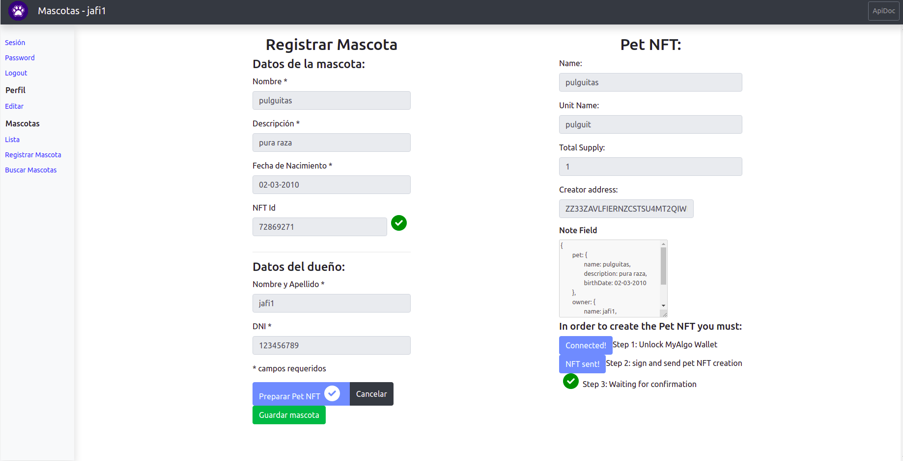

# mascotas_react

## Fork de jafidiesel

Fork del [proyecto mascotas](https://github.com/nmarsollier/mascotas) de [nmarsollier](https://github.com/nmarsollier)

- Se agregó un modulo para integrar el sistema con [MyAlgo Connect](https://connect.myalgo.com/), poder administrar billeteras en la blockchain algorand y crear NFTs de las mascotas.
- Se requiere levantar una imagen de redis
  - docker run -d --name mascotas-redis -d -p 6379:6379 redis:5.0.9-buster
- Se requiere levantar una imagen de mongolistPet
  - docker run -d --name mascotas-mongo -d -p 27017:27017 mongo:4.0.18-xenial
- Se requiere que levantar el back-end [mascotas_node](https://github.com/jafidiesel/mascotas_node) para poder conectarse a redis y mongodb.

## Modulo NFT

### ¿Que es un NFT?

> Los tókenes no fungibles se utilizan para crear una escasez digital verificable, así como brindar una propiedad digital, y la posibilidad de interoperabilidad de los activos en múltiples plataformas. Los NFT se utilizan en varias aplicaciones específicas que requieren artículos digitales únicos, como el criptoarte, los coleccionables digitales y los juegos en línea.
> [wikipedia](https://es.wikipedia.org/wiki/Token_no_fungible)

### ¿Como se aplican los NFTs en el sistema de mascotas?

Cuando se cree una mascota se creara una representación de esta por medio de un NFT en la red algorand. Esta representacion (mediante MyAlgo Connect) se creará en la billetera del dueño que este registrando a la mascota.

### ¿Que representa el NFT de la mascota?

Representa la "titularidad" de la mascota en si. Hoy en dia esta titularidad en muchos lados no es mas que un papel "respaldado" por la veterinaria del barrio que tiene la veracidad que ambas partes dan fe, pudiendo ser adulterada o duplicada.

### ¿Que permitirá tener el NFT de la mascota?

Permitirá tener una representación de la titularidad en un único lugar y permitir así trackear facilmente la informacion de la mascota ya que los datos de la blockchain Algorand son de público acceso.

Además si quisieramos dar en adopción a la mascota bastaría simplemente con transferirle el NFT al próximo dueño, semejante a la adopción de hoy en día que se realiza "de palabra"

### ¿Por qué elegimos MyAlgo Connect?

[MyAlgo Connect](https://connect.myalgo.com/) es una librería fácil de integrar y desbloquea todo el potencial de la blochain Algorand para la creación de NFTs(assets) en su Layer 1 directamente. Además posee una velocidad de transacción de ~4s y sus comisiones (fee/gas fee) son muy bajos.

MyAlgo Connect permite conectarse de forma segura al storage que genera [MyAlgo](https://wallet.myalgo.com/) permitiendo tener fácil acceso a las billeteras creadas sin perder seguridad en el proceso.

## Detalles técnicos

### Funcionalidades

- Creación de la mascota como NFT en la blockchain de Algorand mediante [MyAlgo Connect](https://connect.myalgo.com/)
- Buscador de mascotas por su NFT Id (asset id)

### Screenshots

Pet creation:




List Pet:


Search Pet:


---

---

---

UI en react para el [proyecto mascotas](https://github.com/nmarsollier/mascotas)

Abrir ventana de comandos en la carpeta, ejecutar:

```bash
npm install
npm start
```

Desde un browser debemos abrir [localhost:4200](http://localhost:4200/)

## VSCode

Este proyecto utiliza eslint

```bash
sudo npm install -g eslint
```

## Docker

Podemos usar Docker para levantar este servidor, esta configuración es un build para producción, pero sirve para probarlo:

```bash
docker build --no-cache -t mascotas-react https://raw.githubusercontent.com/nmarsollier/mascotas_react/master/Dockerfile

# Mac || Windows
docker run -it -d --name mascotas-react -p 4200:80 mascotas-react

# Linux
docker run --add-host host.docker.internal:172.17.0.1 -it -d --name mascotas-react -p 4200:80 mascotas-react
```

[Test](http://localhost:4200/)
